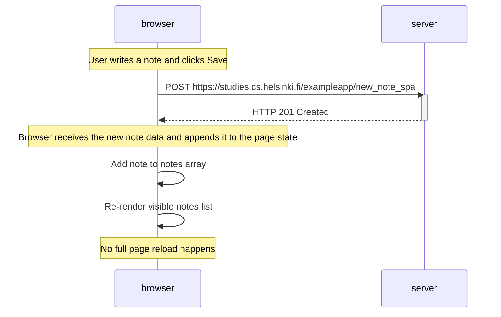

```mermaid
sequenceDiagram
    participant browser
    participant server

    Note over browser: User writes a note and clicks Save

    browser->>server: POST https://studies.cs.helsinki.fi/exampleapp/new_note_spa
    activate server
    server-->>browser: HTTP 201 Created
    deactivate server

    Note over browser: Browser receives the new note data and appends it to the page state
    browser->>browser: Add note to notes array
    browser->>browser: Re-render visible notes list

    Note over browser: No full page reload happens
```

The SPA version sends the note as JSON data, for example:

```json
{
  "content": "A new note",
  "date": "2026-10-15T12:00:00.000Z"
}
```
